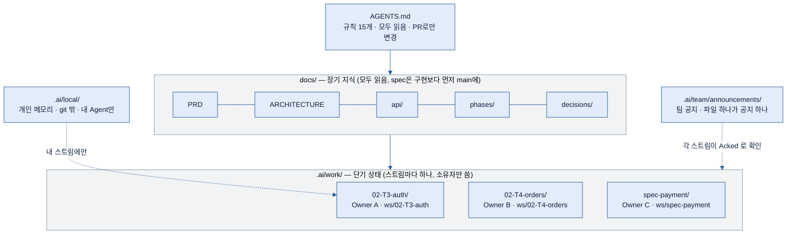
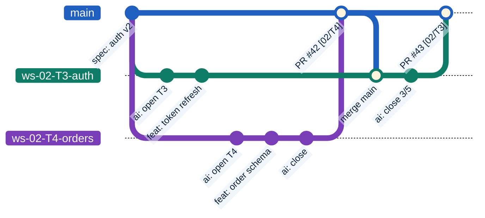
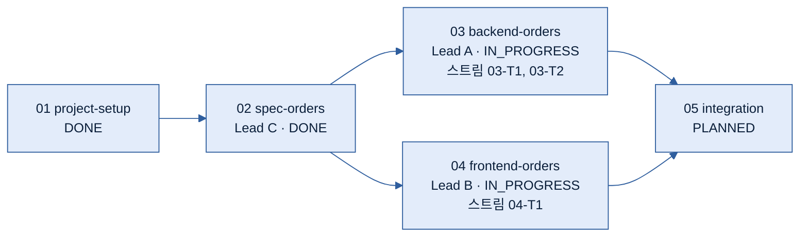

# Team AI-Agent Project Template

여러 개발자가 각자 AI Agent(Claude Code, Codex, Gemini CLI, ChatGPT 등)와 함께 **동시에** 작업해도 문맥이 끊기지 않고 서로의 상태 파일이 충돌하지 않도록 설계된 프로젝트 템플릿이다.
특정 Agent의 대화 기억에 의존하지 않고 **저장소 자체**가 현재 상태·설계 의도·개발 계획·작업 규칙을 설명한다. 개인 프로젝트에서도 같은 구조를 그대로 쓴다.

<!-- 새 프로젝트로 초기화한 뒤에는 이 README를 프로젝트 소개(무엇을, 왜, 어떻게 실행하는지)로 교체한다. 절차는 .ai/BOOTSTRAP.md 참고. 그림은 mermaid — GitHub에서 바로 렌더링된다. -->

## The Idea in One Picture

규칙은 한 곳, 장기 지식은 모두가 공유, 단기 상태는 **작업(스트림)마다 따로**. 서로 다른 사람은 서로 다른 디렉터리만 쓰기 때문에 상태 파일이 병합에서 충돌하지 않는다.



## Design Goals

1. 모든 Agent가 같은 규칙을 공유한다 → 규칙은 `AGENTS.md` 한 곳에만 둔다.
2. 새 Agent는 최소 context만 읽고 작업을 이어간다 → `AGENTS.md` → 내 스트림 `CURRENT.md` → `HANDOFF.md` → 스크립트 출력 → 현재 `PLAN.md`.
3. 장기 지식(`docs/`)과 단기 상태(`.ai/`)를 분리한다.
4. 단기 상태의 단위는 저장소가 아니라 **스트림**이다 → 브랜치 `ws/<id>` = `.ai/work/<id>/` = 소유자 1명 = Task 1개.
5. 개발은 Phase 단위로 계획·검증하고, Phase는 사람별·구성요소별로 병렬 진행할 수 있다 → `docs/phases/`.
6. Agent 간·사람 간 인수인계는 파일로 한다 → `HANDOFF.md`, `ai-stream.sh take`.
7. 사람의 직접 수정과 동료의 변경은 어느 쪽도 되돌리지 않는다 → 커밋 trailer + checkpoint로 자동 분류.
8. Spec(PRD · ARCHITECTURE · API)이 대화보다 높은 source of truth이고, spec 변경은 구현보다 먼저 main에 들어간다.
9. 세션이 언제 끊겨도 저장소만으로 재개한다 → Progress 체크리스트, WIP 커밋, handoff-first.
10. 팀 예절은 문서가 아니라 검사로 건다 → 훅과 CI가 "남의 스트림 수정", "Touches 밖 spec 변경", "미확인 공지"를 막는다.
11. 읽는 사람이 다르면 형식도 다르다 → **커밋은 Agent가 읽는다**(짧고 규격대로, 토큰 절약), **PR·이슈·문서는 사람이 읽는다**(맥락과 가독성).

## Repository Layout

```text
/
├── AGENTS.md                  # 모든 Agent 공통 규칙 15개 (프로세스의 source of truth)
├── CLAUDE.md · GEMINI.md      # 엔진별 진입점 → @AGENTS.md
├── README.md
├── docs/                      # 장기 지식 — 모두가 읽고, PR로만 바뀐다
│   ├── PRD.md                 # 제품 요구사항 (무엇을, 왜)
│   ├── ARCHITECTURE.md        # 현재 구조. Module Boundaries의 Owner 열이 소유권의 기준
│   ├── api/openapi.yaml       # REST API spec (machine-readable)
│   ├── phases/
│   │   ├── README.md          # Phase 표 — 각 PLAN.md 머리에서 생성 (ai-stream.sh phases)
│   │   ├── _template/         # 새 Phase용 PLAN.md / RESULT.md
│   │   └── NN-<name>/         # PLAN.md(Status·Lead·Depends on·Tasks·Touches) / RESULT.md
│   └── decisions/             # ADR — ADR-YYYYMMDD-<slug>.md (병합 = Accepted)
├── .ai/                       # 단기 상태
│   ├── README.md              # .ai/ 구조와 Agent용 이력 조회 가이드
│   ├── BOOTSTRAP.md           # 템플릿 → 프로젝트 초기화 절차 (초기화 후 삭제)
│   ├── work/                  # 스트림 — 브랜치 ws/<id> 하나에 디렉터리 하나
│   │   ├── _template/
│   │   └── <id>/              # CURRENT.md · HANDOFF.md · LOG.md · INBOX.md · notes/
│   ├── team/announcements/    # 팀 공지 (must-read) — 파일 하나가 공지 하나, 스트림이 Acked로 확인
│   └── local/                 # 개발자 개인 폴더 — git 밖. MEMORY.md(내 Agent) · INBOX.md · notes/(나)
├── .githooks/                 # commit-msg(문법 검사·trailer 자동) · pre-push(빠른 점검) · post-merge(유입 요약) · post-checkout
├── .gitmessage                # 커밋 메시지 틀 (setup --local 이 commit.template 으로 등록)
├── .claude/
│   ├── settings.json          # Claude Code 훅 등록 (SessionStart → ai-start.sh, SessionEnd → .lock 해제)
│   ├── hooks/                 # 위 훅 스크립트 (session-start.sh · session-end.sh)
│   ├── agents/git-flow.md     # git 흐름을 맡는 역할 (PR 리뷰·유지보수) — 팀이 공유
│   └── agent-memory/<role>/   # 역할별 프로젝트 메모리 (be-architect 등)
├── .github/                   # (GitHub 사용 시) PR 템플릿 · 이슈 템플릿 · CODEOWNERS · ci.yml · flow.yml
├── scripts/
│   ├── ai-start.sh            # 세션 시작 — 내 스트림 확인, 변경 분류, spec 유입·공지 안내, next steps
│   ├── ai-end.sh              # 세션 종료 점검 · --ready(PR 준비) · --ci(PR 검사)
│   └── ai-stream.sh           # 스트림·Phase·히스토리 관리 (아래 Scripts & Hooks)
├── src/                       # 구현 (단일 패키지 기본값 — 구성요소가 여럿이면 초기화 시
└── tests/                     # 테스트  backend/ frontend/ db/ infra/ 같은 디렉터리로 교체)
```

### 누가 무엇을 쓰는가

| 위치 | 읽는 사람 | 쓰는 사람 | 충돌하지 않는 이유 |
|------|----------|----------|-------------------|
| `docs/` | 모두 | 스트림(PR) | 변경 빈도가 낮고 리뷰를 거친다. spec은 구현보다 먼저 |
| `.ai/work/<id>/` | 모두 읽기 가능 | **소유자만** (사람은 `INBOX.md`에 지시, Agent는 나머지) | 사람마다 다른 디렉터리 |
| `.ai/team/announcements/` | 모두 | 변경을 만든 PR | 파일 하나 = 공지 하나, 고치지 않는다 |
| `.ai/local/` | 나와 나의 Agent | 나(`INBOX.md`·`notes/`)와 나의 Agent(`MEMORY.md`) | git 밖 — 팀에 보이지 않는다 |
| `.claude/agent-memory/` | 그 역할 | 그 역할 (PR 준비 시) | 항목이 독립적, union merge |

**개발자 개인 폴더 `.ai/local/`** — `.gitignore`로 제외되어(README만 추적) 이 clone의 주인과 그 Agent만 쓴다. `scripts/ai-stream.sh setup --local`이 만든다.

| 파일 | 누가 쓰나 | 무엇을 |
|------|----------|--------|
| `MEMORY.md` (50줄 상한) | 내 Agent | 나에 대해 배운 것 — 선호, 교정, 자주 하는 실수, 내 환경. Agent가 세션 시작 시 `CURRENT`·`HANDOFF` 다음으로 읽는다. 프로젝트 사실은 여기가 아니라 역할 메모리나 `docs/`로 |
| `INBOX.md` | 나 | 팀에 보이고 싶지 않은 지시. 스트림 `INBOX.md`와 같은 형식·같은 우선순위(Truth ①) |
| `notes/` | 나 | 개인 메모 |

세 층을 나누는 기준은 "누가 봐야 하는가"다: 팀 전체가 행동해야 하면 `announcements/`, 이 작업을 잇는 사람이 알아야 하면 스트림 `HANDOFF`·`INBOX`, 나만 알면 되면 `.ai/local/`. 기기를 여러 대 쓰면 `setup --local --local-memory <개인 경로>`로 심링크해 같은 메모리를 공유한다. 백업은 git이 해 주지 않으므로 본인 몫이고, 비밀값은 여기에도 두지 않는다.

## How to Use This Template

### 리드 (프로젝트 시작)

1. 이 저장소를 "Use this template"로 복제해 새 저장소를 만든다.
2. `.ai/BOOTSTRAP.md`의 **Project Description**을 채우고, Agent에게 `BOOTSTRAP.md`를 수행하라고 지시한다 (`ws/chore-bootstrap` 브랜치에서). Agent가 스택·저장소 구성을 정하고 placeholder를 채우고 ADR과 Phase 계획을 만든 뒤 `BOOTSTRAP.md`를 삭제한다.
3. `scripts/ai-stream.sh setup`을 실행한다 — main 보호, merge commit 병합(squash 금지), 병합 메시지 "제목 + 본문", 브랜치 자동 삭제, CODEOWNERS 생성. `gh`가 없으면 수동 체크리스트가 출력된다.
4. `docs/ARCHITECTURE.md` Module Boundaries의 Owner 열에 구성요소별 담당을 적는다.

### 팀원 (합류)

1. clone 후 `scripts/ai-stream.sh setup --local` — 훅 경로, 커밋 메시지 틀, `git ai-log` alias, `.ai/local/` 생성 (여러 기기를 쓰면 `--local-memory <개인 경로>`로 심링크).
2. `git config user.email`이 팀에서 쓰는 주소인지 확인한다. 이 주소가 스트림 소유자 식별자다.
3. Agent 진입점은 아래 표. 규칙은 `AGENTS.md` 하나다.

### 개인 프로젝트

같은 절차에서 PR만 빠진다. `ai-stream.sh open` → 작업 → `ai-stream.sh merge`(같은 검사 후 로컬 `--no-ff` 병합). `origin`이 없어도 모든 스크립트가 로컬 브랜치를 본다.

## Daily Flow — Task 하나의 생애

```mermaid
%%{init: {'theme': 'base', 'themeVariables': {'primaryColor': '#E3ECFA', 'primaryTextColor': '#0B1F3A', 'primaryBorderColor': '#2F5E9E', 'lineColor': '#2F5E9E', 'textColor': '#0B1F3A', 'clusterBkg': '#F1F3F5', 'clusterBorder': '#8A97A6', 'edgeLabelBackground': '#FFFFFF', 'fontSize': '14px'}}}%%
flowchart LR
  O["ai-stream.sh open 02/T3 auth<br/>브랜치 ws/02-T3-auth<br/>+ .ai/work/02-T3-auth/ · push"]
  subgraph SESSION["세션 (반복)"]
    direction LR
    ST["ai-start.sh<br/>Resume? · 공지 · 유입 spec · 직접 수정"]
    IM["구현<br/>Progress 갱신 · WIP 커밋"]
    EN["ai-end.sh<br/>점검 → close commit → push"]
    ST --> IM --> EN
  end
  RD["ai-end.sh --ready<br/>Status=REVIEW · PR 초안"]
  PR["PR 리뷰"]
  M["main<br/>(merge commit)"]
  CL["Phase 종료<br/>ws/phase-02-close<br/>RESULT · phases 표 · gc · tag"]
  O --> SESSION --> RD --> PR --> M --> CL
  PR -. 수정 요청 → INBOX .-> SESSION
```



- **세션 시작**: `AGENTS.md`(자동 로드되면 생략) → 내 스트림 `CURRENT.md` → `HANDOFF.md` → `.ai/local/MEMORY.md`(있으면) → `scripts/ai-start.sh`의 next steps (Resume 여부, 미확인 공지, main에서 유입된 spec 변경, 직접 수정 반영, 현재 PLAN) → 구현.
- **작업 중**: step마다 `CURRENT.md` Progress 갱신, 긴 Task는 WIP 커밋(`Wip:` trailer). main 동기화는 `git merge main`(rebase 아님).
- **세션 종료**: test → typecheck → lint → 작업 커밋 → `CURRENT`·`HANDOFF`·`LOG` → `scripts/ai-end.sh --set-checkpoint` → close commit(내 스트림·docs/phases·docs/decisions·agent-memory만) → push.

### 두 사람이 동시에 일하면

서로 다른 스트림은 서로 다른 디렉터리만 고치므로 병합에서 만나지 않는다. 먼저 병합된 쪽의 변경은 다른 쪽이 `git merge main`할 때 "동료 변경"으로 안내된다.



(그림의 브랜치 이름은 mermaid 제약으로 `ws-`를 썼다. 실제 브랜치는 `ws/02-T3-auth`다. A가 `merge main`하는 시점에 B의 PR #42가 "동료 변경"으로 안내된다.)

## Phases — 병렬로 흐른다

Phase는 "독립적으로 검증 가능한 결과 하나"이고, `Depends on`으로 이어진 그래프다. 의존이 없는 Phase는 사람별·구성요소별로 동시에 진행하며 Phase마다 Lead가 있다. 표(`docs/phases/README.md`)는 각 `PLAN.md` 머리에서 생성한다.



## Two Audiences — 커밋은 Agent가, PR은 사람이 읽는다

| | 커밋 메시지 | PR · 이슈 · 문서 |
|---|---|---|
| 독자 | Agent (사람은 GitHub UI로 본다) | 개발자·리뷰어 |
| 목표 | `--grep` 한 번에 찾기, 한 줄 ≈ 20토큰 | 맥락이 한눈에, 리뷰 포인트가 분명 |
| 형식 | `<type>(<scope>): <summary>`(영어, ≤ 60자) + 키-값 body ≤ 5줄 + 고정 trailer(`Agent Task Stream Spec Refs Wip`) | 한국어 산문 + 섹션(무엇을·왜 / 리뷰 포인트 / Spec 변경 / 확인 방법), 에이전트 산출물은 접힘, 맨 끝에 trailer 블록 |

```text
feat(backend): add token refresh

Why: 세션 만료 시 재로그인 없이 갱신 (FR-7)
Test: tests/auth/test_refresh.py 3건

Agent: claude-code
Task: 02/T3
Stream: 02-T3-auth
Spec: no
```

- 스트림 부기(open · close · take)는 type `ai`로 모아 두므로 기능 이력만 보려면 `--invert-grep --grep='^ai('` 한 번이면 된다.
- Agent는 `git log`를 맨몸으로 부르지 않는다 — `git ai-log -n 20`(한 줄 형식), `--first-parent main`, `--grep='^Task: 02/T3'`, `-- <path>`, diff 전에 `--stat`. 전체 레시피는 `.ai/README.md`.
- PR 제목은 `<type>(<scope>): <summary> [<phase>/<task>]` — 병합 메시지가 "제목 + 본문"이므로 main의 first-parent 로그에서 PR 하나가 한 줄이고, 본문 끝의 trailer 블록이 merge commit의 trailer가 된다. Agent는 본문 산문을 읽지 않는다.

## Roles

| 역할 | 하는 일 |
|------|--------|
| 리드 | Phase 계획(`ai-stream.sh phase new`), spec·ADR 승인, 공지 작성, `docs/`의 CODEOWNER |
| 개발자 | 스트림 소유. 자기 Agent에게 INBOX로 지시, PR 본문 다듬기와 리뷰, 동료 스트림은 읽기만 |
| 작업 Agent | 스트림 안에서 규칙대로 구현·문서화. `AGENTS.md`가 유일한 규칙 |
| 역할 Agent (be-architect 등) | 전문 판단. 프로젝트 메모리는 `.claude/agent-memory/<role>/` |
| flow 역할 (`git-flow`) | CI에서 PR 리뷰(본문↔HANDOFF 일치, Spec changes, 공지 필요 여부), 매일 유지보수(stale 스트림, drift). 코멘트와 PR로만 말한다 — 전략은 ADR이 정한다 |

## Agent Entry Points

| Agent | 읽는 파일 | 비고 |
|-------|-----------|------|
| Codex (CLI / ChatGPT) | `AGENTS.md` | 기본 지원 |
| Claude Code | `CLAUDE.md` → `AGENTS.md` | `@AGENTS.md` import. `.claude/agents/`의 역할을 서브에이전트로 인식. `.claude/settings.json`의 훅이 세션 시작 시 `ai-start.sh`를 자동 실행하고 `AI_AGENT=claude-code`를 설정한다 |
| Gemini CLI | `GEMINI.md` → `AGENTS.md` | `@./AGENTS.md` import |
| 웹 채팅(ChatGPT, Claude 등) | `AGENTS.md` + 내 스트림 `CURRENT.md` + `scripts/ai-start.sh` 출력을 첫 메시지로 | 결과는 사람이 저장소에 반영하고 trailer를 붙여 커밋 |
| 기타 도구(Cursor, Copilot 등) | 도구별 설정에서 `AGENTS.md` 참조 | 규칙을 복사하지 않는다 |

Agent CLI를 쓸 때는 환경변수 `AI_AGENT=<이름>`(예: `claude-code`)을 두면 `commit-msg` 훅이 `Agent:` trailer를 자동으로 붙인다.

## Scripts & Hooks — 무엇이 무엇을 하나

스크립트는 셋뿐이다. `ai-start.sh`는 **지금 상황 읽기**, `ai-end.sh`는 **끝낼 자격 검사**(같은 검사를 pre-push에서는 가볍게, CI에서는 전부), `ai-stream.sh`는 **스트림·Phase·이력의 생성과 조회**. 훅은 이 셋을 git 이벤트에 붙이는 접착제다. LLM을 부르는 것은 `flow` 하나뿐이고 나머지는 전부 결정적이다.

### `scripts/` — 사람·Agent가 직접 부른다

| 명령 | 언제 | 하는 일 | 바꾸는 것 |
|------|------|---------|-----------|
| `ai-start.sh` | 세션 시작 | 내 스트림 확인(`ws/*`·소유자·`.lock`) → checkpoint 이후 커밋을 **직접 수정 / 동료 유입 / 남의 스트림**으로 분류 → INBOX·미확인 공지·REVIEW 재작업·Touches가 겹치는 활성 스트림·컨텍스트 크기 → next steps | `.lock`만 |
| `ai-start.sh --diff` | 직접 수정을 살필 때 | 위 + 사람 커밋의 변경 파일 목록 | 없음 |
| `ai-start.sh --upstream` | `post-merge` 훅이 호출 | 유입 변경 분류만, lock 없음 | 없음 |
| `ai-start.sh --force` | 죽은 세션의 lock 정리 | `.lock`이 있어도 진행 | `.lock` |
| `ai-end.sh` | close commit 전 | 종료 점검: Status≠IN_PROGRESS, 상한, placeholder, close 범위, 비밀값, 미커밋 변경 | 없음 |
| `ai-end.sh --set-checkpoint` | 종료 절차 | CURRENT의 Last Checkpoint를 HEAD로 기록한 뒤 점검 | `CURRENT.md` |
| `ai-end.sh --ready [--pr]` | Task 완료 | main 동기화·spec·공지 검사 → Status=REVIEW 커밋·push → PR 제목·본문 초안 출력(`--pr`: `gh`로 생성/갱신) | 커밋·push |
| `ai-end.sh --quick` | `pre-push` 훅이 호출 | 브랜치·남의 스트림 디렉터리·비밀값만, 수 초 | 없음 |
| `ai-end.sh --ci` | GitHub Actions `ai-check` | PR 검사 전부: 브랜치명, 남의 스트림 미수정, main 동기화, Touches 밖 spec 변경, AGENTS.md 변경 시 공지, Required 공지 ack, PR 제목 규격, 생성 파일 drift, 상한, 비밀값, `{{` 잔여 | 없음 (exit 1 = 병합 차단) |
| `ai-stream.sh open <NN>/<Tk> <slug>` · `open spec\|chore\|plan\|phase-close <slug> --touches …` · `--reopen` | 작업 시작 | 브랜치 `ws/<id>` + `.ai/work/<id>/`(템플릿 치환) + push. Touches 겹침 경고. `--reopen`은 `-r2` + `Supersedes:` | 브랜치·커밋·push |
| `ai-stream.sh take` | 인수인계 | 현재 스트림 Owner를 나로 바꾸는 커밋 + push | 커밋·push |
| `ai-stream.sh status` | 현황 볼 때 | 원격 `ws/*`에서 팀 현황판 도출 — Phase·소유자·Task·Status·경과일·stale·Touches 겹침 | 없음 |
| `ai-stream.sh gc [--dry-run]` | Phase 종료 스트림 | 병합됐고 브랜치가 없는 스트림 디렉터리 `git rm`(커밋은 호출자) | 스테이징 |
| `ai-stream.sh merge` | 1인 프로젝트만 | `--ci` 통과 후 로컬 `--no-ff` 병합(PR 대용) | main |
| `ai-stream.sh tag NN` | Phase 종료 PR 병합 뒤 | `phase/NN` 태그 + push | 태그 |
| `ai-stream.sh phases [--check]` | PLAN 머리 변경 시 / CI | `docs/phases/README.md` 표 생성 / drift 검사 | README 표 |
| `ai-stream.sh phase new <name>` | 새 Phase | 다음 번호로 Phase 골격 + `plan-NN-<name>` 스트림 | 파일·브랜치 |
| `ai-stream.sh history …` | 이력 조회 | `git ai-log` 래퍼: `--type` `--scope` `--phase` `--task` `--stream` `--agent` `--spec` `--no-ai` `--branches` `-n` `-- <path>` | 없음 |
| `ai-stream.sh digest [--since]` | 회고·주간 정리 | main 병합 커밋마다 그 시점 스트림 LOG 맨 위 항목을 모아 출력(gc 뒤에도) | 없음 |
| `ai-stream.sh announce [--check]` | 공지 추가 시 / CI | `.ai/team/README.md` 공지 색인 생성 / 검사 | 색인 |
| `ai-stream.sh codeowners [--check]` | Owner 열 변경 시 / CI | ARCHITECTURE Module Boundaries의 Owner 열 → `.github/CODEOWNERS` | CODEOWNERS |
| `ai-stream.sh setup` | 리드, 저장소 1회 | main 보호·merge commit만·병합 메시지 제목+본문·브랜치 자동 삭제 등 저장소 설정 체크리스트 | GitHub 설정 |
| `ai-stream.sh setup --local [--local-memory <path>]` | 팀원, clone 1회 | `core.hooksPath` · `commit.template` · `ai-log` alias · `.ai/local/` 생성(개인 경로 심링크 옵션) | 로컬 git config |
| `ai-stream.sh flow review\|maintain\|setup` | CI·수동 | git-flow 역할에 줄 프롬프트 + 컨텍스트 출력 | 없음 |
| `lib/common.sh` | 직접 실행 안 함 | 위 셋이 source — 경로 상수, 필드/섹션 파서, `ws_refs`, Touches 매칭·겹침, 공지 적용 판정, 비밀값 스캔, 템플릿 `render` | — |

### `.githooks/` — git이 자동으로 부른다 (`setup --local`로 활성화)

| 훅 | 시점 | 하는 일 | 실패 시 |
|----|------|---------|---------|
| `commit-msg` | 커밋 메시지 확정 직전 | subject `<type>(<scope>): <summary>` 문법·길이 검사, `Stream:`(브랜치)·`Agent:`(`$AI_AGENT`)·`Spec:`(docs/ staged) trailer 자동 추가. 병합·revert·fixup은 건너뜀 | 커밋 거부(`--no-verify`로 우회, CI가 재검사) |
| `pre-push` | push 직전, `ws/*`에서만 | `ai-end.sh --quick` | push 거부 |
| `post-merge` | `git merge main` 뒤 | `ai-start.sh --upstream` 결과를 `[post-merge]` 접두로 출력(저장 안 함) | 없음(정보) |
| `post-checkout` | `ws/*`로 옮겼을 때 | 스트림 요약 한 줄 + 소유자가 내가 아니면 경고 | 없음(정보) |

### `.claude/hooks/` — Claude Code가 자동으로 부른다 (`.claude/settings.json`에 등록, 저장소에 포함)

세션 절차 중 "시작"을 규칙이 아니라 훅으로 강제한다. 종료 절차(`ai-end.sh` → close commit → push)는 Agent가 규칙대로 수행하고, 빠뜨리면 `pre-push`와 CI가 잡는다.

| 훅 | 시점 | 하는 일 | 실패 시 |
|----|------|---------|---------|
| `session-start.sh` | 세션 시작·재개·`/clear`·compact | `AI_AGENT=claude-code`를 세션 환경에 설정(`commit-msg`가 `Agent:` trailer를 붙임) → `scripts/ai-start.sh` 실행, 출력을 Agent 컨텍스트에 추가. 재개·compact는 같은 세션의 `.lock`이므로 `--force` | 항상 exit 0 — `ai-start.sh`가 실패하면(스트림 없음·소유자 다름·다른 세션의 lock) 그 안내가 컨텍스트에 들어가고 Agent는 해결 전까지 구현을 시작하지 않는다 |
| `session-end.sh` | 세션 종료 | 내 스트림의 `.lock` 해제 | 없음 |

다른 Agent CLI(Codex·Gemini)는 같은 절차를 `AGENTS.md` Session Procedure대로 직접 수행한다. 도구별 훅이 있으면 같은 스크립트를 등록하면 된다.

## For Developers

- **내 작업 현황**: `.ai/work/<id>/LOG.md` 맨 위 항목. PR을 낼 때 `--ready`가 이것을 사람이 읽을 순서로 재배열한 초안을 준다.
- **팀 현황**: `scripts/ai-stream.sh status`, 또는 PR 목록(라벨 `type:*` · `scope:*` · `phase:*`).
- **무슨 일이 있었나**: GitHub의 PR 목록이 사람용 이력이다. 터미널에서는 `git ai-log --first-parent main -n 20`.
- **직접 수정**: 평소처럼 커밋한다(`.gitmessage` 틀이 뜬다). 다음 세션이 "사람의 직접 수정"으로 분류해 되돌리지 않고 반영한다.
- **지시 남기기**: `.ai/work/<id>/INBOX.md`에 한 줄. 팀 전체가 봐야 하면 공지(`.ai/team/announcements/`)를 변경 PR에 같이 넣는다 — `Required: yes`면 각 스트림이 확인(Acked)하기 전에는 PR이 병합되지 않는다.
- **동료에게 요청**: 이슈(`task-request` 템플릿)나 PR 코멘트로. 소유자가 자기 INBOX로 옮긴다. 남의 `.ai/work/<id>/`는 고치지 않는다(CI가 막는다).
- **중단된 세션**: 내 스트림 `CURRENT.md`의 Status가 `IN_PROGRESS`면 세션이 끊긴 것이다. 그대로 Agent를 시작하면 Resume 절차를 따른다. 동료 스트림의 `IN_PROGRESS`는 정상 작업 중이라는 뜻이다.
- **인수인계**: `HANDOFF.md`의 `To:`에 다음 사람을 적어 push하면, 그 사람이 `ai-stream.sh take`로 잇는다.

## Rules of Thumb

1. push하지 않은 것은 팀에 없는 것이다 — open · close commit · WIP는 push한다.
2. 남의 스트림 디렉터리는 읽되 쓰지 않는다.
3. spec을 바꿔야 하면 spec 스트림으로 먼저 main에 넣는다. 내 Touches 안의 작은 인터페이스 변경만 구현 PR에 실을 수 있다.
4. Touches 밖 파일을 고치고 싶으면 먼저 제안하고, 승인되면 `CURRENT.md`의 Touches를 고친 뒤 작업한다.
5. 커밋은 짧고 규격대로, 설명은 PR에. 비밀값은 `.ai/`에도, `.ai/local/`에도 적지 않는다.

## Where to Read More

- 규칙 전체: `AGENTS.md` (15개 Rules · Session Procedure · Commit Format · History)
- 왜 이런 구조인가: `docs/decisions/` — 저장소를 공유 메모리로(ADR-20260829-…), checkpoint와 세션 안전, 규칙·절차 분리, 실행 가능한 제약, 스트림 상태와 브랜치·PR 협업(ADR-20260907-…), git 전략
- `.ai/` 세부와 Agent용 이력 조회 가이드: `.ai/README.md` · 공지 형식: `.ai/team/README.md`
